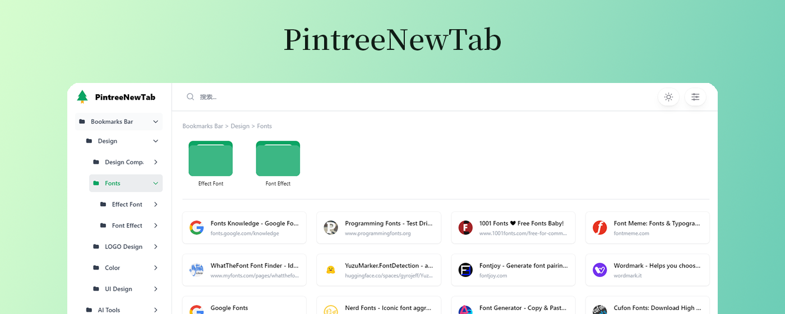

# PintreeNewTab

PintreeNewTab 是一个基于[Pintree](https://github.com/Pintree-io/pintree)的开源项目，旨在将浏览器书签作为标签页。通过安装插件将不方便管理的书签转换成一个美观且易用的导航页面。

## 安装和运行

### Edge浏览器

1. 安装 [PintreeNewTab](https://chromewebstore.google.com/detail/pintree-bookmarks-exporte/mjcglnkikjidokobpfdcdmcnfdicojce) 插件。
2. 点击插件图标，就会打开新标签页。

### chrome浏览器

---

## 使用技术

- HTML/CSS/JavaScript
- JSON格式处理
- 浏览器扩展