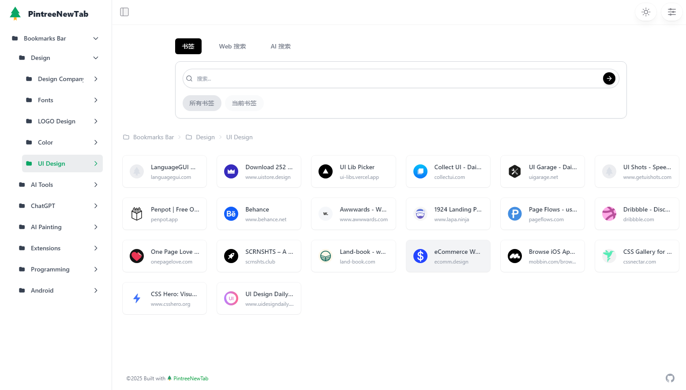

# PintreeNewTab

[中文](README.md) | [English](README_en.md)

PintreeNewTab is an open-source project based on [Pintree](https://github.com/Pintree-io/pintree), designed to transform browser bookmarks into a new tab page. By installing the plugin, it converts inconvenient bookmark management into a visually appealing and user-friendly navigation page.

## Supported Languages

- Simplified Chinese
- Traditional Chinese
- English
- Japanese
- Russian
- Korean
- German

## Installation and Running

### Edge/Chrome Browser

1. Install the Edge ([PintreeNewTab](https://microsoftedge.microsoft.com/addons/detail/pintreenewtab/mjiogedjmkbihhahaljlefekjbcgplog)) or Chrome ([PintreeNewTab](https://chromewebstore.google.com/detail/ekfkalhnkifkoijcioheanlegfgcgnee)) plugin.
2. Click the plugin icon to open a new tab.

### Manual Installation and Update

1. Download the `dist.zip` file and extract it.

2. Open Chrome browser, navigate to chrome://extensions/, enable Developer mode, click "Load unpacked extension", and select the extracted folder.

3. Click the plugin icon to open a new tab.

## Technologies Used

- HTML/CSS/JavaScript
- JSON processing
- Browser extensions